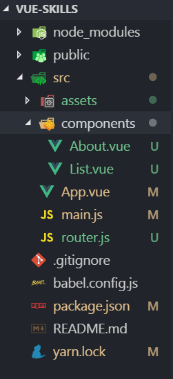

vue를 사용하는 이유.
1. 데이터바인딩 / 자료 interation / DOM 조작이 매우 쉬워짐
2. 요소를 실시간으로 반응시켜야 할 때
3. Component 기반 개발방식을 적용할 때
4. SPA를 만들 때

 
 
 

### VUE/CLI 

vue/cli는 쉽게 vue 프로젝트 뼈대를 생성할 수 있게 도와주는 라이브러리 이다. 
-g는 다름 프로젝트 폴더에서도 vue/cli를 사용하기 위해 글로벌하게 설치할 때 사용한다.

> yarn global add @vue/cli 
> npm install -g @vue/cli 

 
 
 

### 새로운 프로젝트 생성하기 

1. 일단 작업용 폴더를 하나 만들고 에디터에서 연다.
2. New Terminal 터미널을 연다.
3. 프로젝트 생성 명령어 입력
> vue create 프로젝트명
4. 선택한 화면이 나오면 착하게 엔터키만 친다.
5. 생성된 프로젝트명 하위폴더를 다시 에디터로 오픈한다.

 
 
 

### 서버실행 

> yarn serve
> npm run serve

 
 
 

### 배포용 파일 생성 

> yarn build
> npm run build

 
 
 

### 터미널이 싫거나 명령어를 까먹으면 

> vue ui

 
 
 

### VUE 폴더구조 설명 

1. node_modules : 필요한 npm 패키지 담기는 곳
2. assets 폴더 : 이미지 등 필요한 파일들을 담는 곳
3. public 폴더 : 웹사이트 발행시에도 남길 파일들을 담는 곳
4. components : 본격적인 vue 컴포넌트 파일 생성하는 곳
5. App.vue : 메인 컴포넌트
6. index.html : 메인 HTML 페이지 (App.vue를 이곳에 붙여넣음)
7. App.vue를 작업해서 - main.js에서 렌더링해서 - index.html 에 뿌려짐

 
 
 